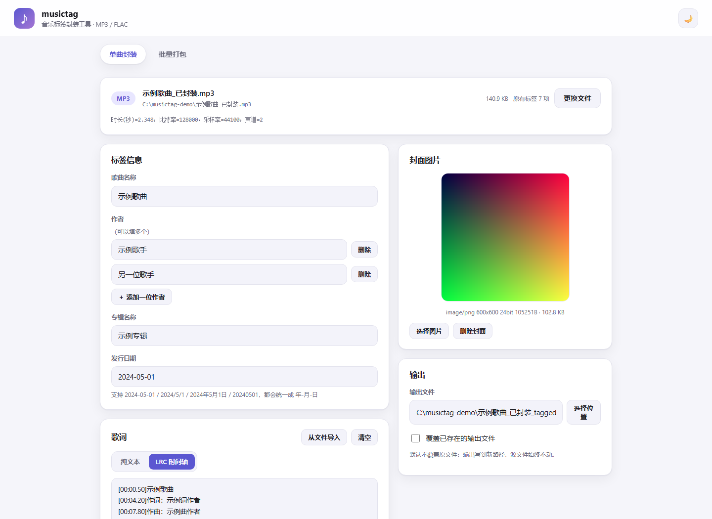
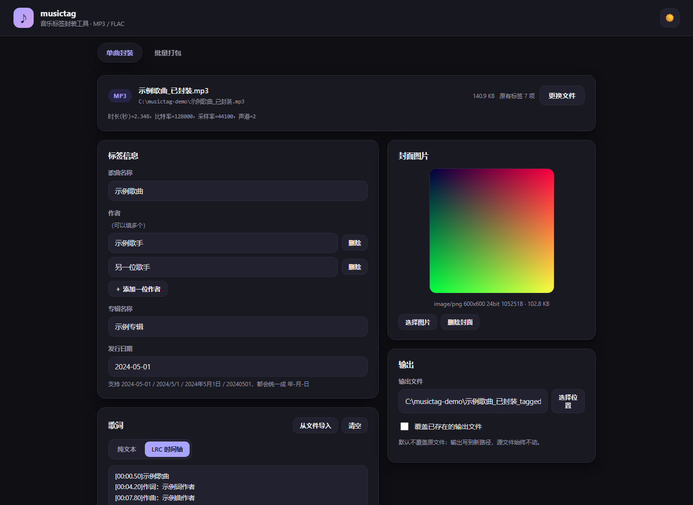
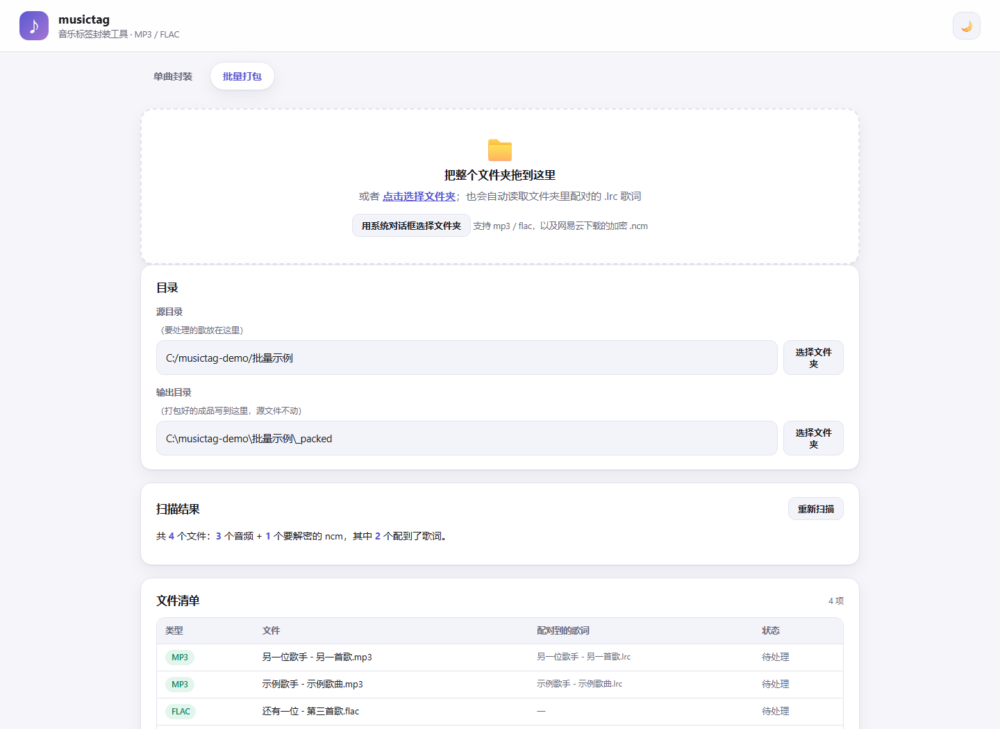

# musictag

**把歌曲名称、作者、专辑名称、发行日期、封面图片、歌词写进 MP3 / FLAC —— 只改标签区，音频数据逐字节不动。**

[](https://www.python.org/)
[-4B8BBE)](https://mutagen.readthedocs.io/)
[](#图形界面)
[](#测试)
[](LICENSE)



---

## 为什么可以直接用

| 你担心的 | 这个工具的做法 |
| --- | --- |
| 音质会不会变差 | 全程**不重新编码**。写入前后对纯音频数据段做 **SHA256** 比对，不一致就**放弃输出**，原文件不动 |
| 会不会把原文件写坏 | 默认**只写新文件**。流程是「复制原文件到临时文件 → 在临时文件里改标签 → 校验指纹 → 原子替换」，写坏了也只是丢个临时文件 |
| 会不会丢了我原来的标签 | 没指定的字段**一律保留**。替换封面时只删「封面」那一张，封底 / 艺人照 / 流派 / 音轨号都留着 |
| 播放器认不认 | 按各平台的主流写法落盘：MP3 用 ID3v2.4（原文件是 v2.3 就保持 v2.3），FLAC 用 Vorbis Comment，键名大写 |
| 写进去了吗 | 写完**自动重新打开输出文件逐项核对**并打印结果，也可以事后单独校验 |

---

## 快速开始

### 1. 装依赖

只需要 Python 3.8+ 和 [`mutagen`](https://mutagen.readthedocs.io/)：

```bash
pip install mutagen
```

`mutagen` 是纯 Python 标签库，**不含任何音频编码器** —— 所以这个工具在物理上就不可能重新编码音频。

### 2. 启动

**Windows**：双击 `musictag\点我运行.bat`（会自动找 `py` 或 `python`，缺依赖时把安装命令打给你看）。

**任意平台**：

```bash
python musictag/webui.py
```

浏览器会自动打开 <http://127.0.0.1:8770/>，按 `Ctrl+C` 退出。

> 没装依赖就启动的话，会看到 `ModuleNotFoundError: No module named 'mutagen'` —— 回到第 1 步即可。

---

## 图形界面

界面只是 `musictag/core.py` 外面的一层壳：**标签的读写、图片校验、日期归一、写入后校验全部走同一套核心代码**，
所以命令行能给出的保证它一个都不少。整个界面**只用 Python 标准库**（`http.server` + `tkinter`），
不需要 `flet`、`PySide6` 之类的大依赖，以后要用 Nuitka 打包成单文件也方便。

| 亮色 | 暗色 |
| --- | --- |
|  |  |

### 单曲封装

1. **导入文件** —— 三种方式任选：
   - 把 MP3 / FLAC **直接拖进窗口**；
   - **点击**虚线区域，用浏览器自己的文件选择框；
   - 点 **「用系统对话框打开本机文件」**，直接操作磁盘上的那个文件（**不复制**）。
2. 选好后**自动读出并显示已有标签**：文件卡片上列出格式、字节数、采样率 / 声道 / 位深 / 时长，以及原有标签项数。
3. 在表单里改**你想改的字段**，没动过的字段一律保持原样。
   - **作者**可以点「＋ 添加一位作者」加多个，也能逐个删除。
   - **发行日期**边打字边提示归一化结果（写 `2024年5月1日`，它会告诉你将写成 `2024-05-01`）。
   - **封面**支持 JPG / PNG，选中后立即预览，可以更换，也可以删除。
   - **歌词**可以直接粘贴，也可以「从文件导入」`.txt` / `.lrc`，并选择按**纯文本**还是 **LRC 时间轴**写入。
4. **输出路径**默认是原文件同目录下的 `原名_tagged.扩展名`，**源文件永远不动**。
   想先确认到底会改什么，点 **「试运行」**（不写任何文件，只列出改动）。
5. 点 **「开始封装」**。进度条走的是**真实步骤**（读取源标签 → 比对改动 → 写入并核对音频指纹 → 重新打开逐项校验），
   不是装饰动画。
6. 完成后列出**逐项校验结果**和**旧值 → 新值**清单；点 **「打开输出文件夹」** 会直接在资源管理器里定位到输出文件。

### 批量打包页签

顶栏的 **「批量打包」** 是给整个目录用的（网易云下载目录那种一首歌配一个 `.lrc` 的情况，见下一节）：



1. 选**源目录**（点「选择文件夹」，或把整个文件夹拖进去）。
2. 自动扫描并列出**每个文件配到了哪个歌词**、哪些歌词**找不到音频**、哪些 `.ncm` 不需要解密。
3. 勾选 **「只处理配到歌词的文件」**（默认勾着）—— 没歌词的文件不会被白白复制一份。
4. 点 **「开始打包」**，进度条按文件数实时推进，每行状态跟着变。
5. 完成后显示写出 / 跳过 / 失败的数量，可以一键打开输出文件夹。

### 界面说明与限制

- 服务**只监听本机 `127.0.0.1`**，不对外网开放；每次启动生成一个随机会话令牌，页面发出的请求都要带上它。
  重启服务后令牌会变，**需要刷新页面**。
- 浏览器出于安全**不会把拖拽文件的真实路径交给网页**，所以拖进来的文件会先复制到
  `%LOCALAPPDATA%\musictag-ui\import\`（重名自动加 `(1)`）。想直接操作原文件就用「系统对话框打开本机文件」——
  那是**原地处理，一个字节都不复制**。拖文件夹同理，超过 300 MB 时界面会直接劝你用对话框。
- 界面**不接受输出路径等于源文件**，勾了「覆盖已存在的输出文件」也不行 —— 源文件始终不被改写。

---

## 批量打包：网易云下载目录

网易云音乐会**把歌词作为单独的 `.lrc` 文件**和音频下载在同一个目录里，会员下载的音频还可能是加密的 `.ncm`。
这个工具可以把整个目录一次处理完：**解密 ncm、把配对的歌词写进标签、原样补上 ncm 里内嵌的封面**，
源文件一个字节都不改，成品统一写到输出目录。

```bash
# 先看看会做什么（不写任何文件）
python musictag/batch.py "D:\CloudMusic\VipSongsDownload" --dry-run

# 只处理配到歌词的那几首（推荐：没歌词的不复制，省时间省空间）
python musictag/batch.py "D:\CloudMusic\VipSongsDownload" --only-with-lyrics

# 全部处理，输出到指定目录
python musictag/batch.py "D:\我的歌" --out "D:\打包结果" --lyrics lrc
```

图形界面里对应的是**「批量打包」页签**：选目录 → 自动扫描 → 看清单 → 「开始打包」，进度是真实的逐文件进度。

| 参数 | 说明 |
| --- | --- |
| `src_dir` | 要处理的目录（位置参数，必填） |
| `--out` / `-o` | 输出目录，默认是 `<源目录>\_packed` |
| `--lyrics` / `-l` | 歌词写法：`lrc`（默认，保留时间轴）、`text`（去时间轴）、`raw`（原样不改） |
| `--only-with-lyrics` | 只处理配到歌词的文件，其余原样留在源目录不复制 |
| `--dry-run` / `-n` | 只扫描并打印计划，不写任何文件 |
| `--limit N` | 只处理前 N 个（配合 `--dry-run` 看样例很方便） |
| `--force` / `-f` | 覆盖输出目录里已存在的同名文件 |

退出码：`0` 成功、`2` 出错或有失败项、`130` 被 Ctrl+C 中断。

### 它怎么配对歌词

按**去掉扩展名后的文件名**配对：`GAI周延 - 故湘，风.ncm` ↔ `GAI周延 - 故湘，风.lrc`。
文件名里歌手和曲名顺序相反也能认出来（`A - B.mp3` 能配上 `B - A.lrc`），但**只有唯一命中才会采用**，
有歧义就跳过并在结果里说明。

### 网易云的 .lrc 不是标准 LRC

它开头几行是**制作信息**，用的是 JSON：

```
{"t":0,"c":[{"tx":"演唱: "},{"tx":"GAI周延"}]}
{"t":661,"c":[{"tx":"作词: "},{"tx":"Ranzer"}]}
[00:05.00]纯音乐，请欣赏
```

直接原样塞进歌词标签，播放器会把那几行 JSON 也显示出来。所以默认的 `--lyrics lrc`
会把 JSON 行转成正常的歌词行（`[00:00.00]演唱: GAI周延`），标准 `[mm:ss.xx]` 行原样保留；
想完全不动就用 `--lyrics raw`。

### 关于 .ncm

`.ncm` 是网易云的加密容器。解密是**纯 Python 实现的 AES-128-ECB**（含 S-box 生成、密钥扩展、
逆轮变换，用 FIPS-197 官方测试向量验证过），**不依赖任何第三方加密库**：
密钥块经过 `neteasecloudmusic` 前缀异或，元信息经过 `music:` 前缀异或再 base64，
音频部分是周期恰好 256 字节的流密码异或（所以可以整块 `int.from_bytes` 异或，不必逐字节跑 Python 循环）。

解密**不重新编码**，出来的就是原始音频字节。解密出来的音频如果标签里有空着的字段，
会用 ncm 内部记录的元信息补上（歌曲名 / 作者 / 专辑 / 内嵌封面）；**已有的标签一律不动**。

### 会如实告诉你的三件事

1. **配不到音频的歌词**会单独列出来，不会被硬塞给某首歌。
2. **同名音频已经存在**的 `.ncm` 会被跳过（不需要再解密一遍）。
3. **发行日期补不了** —— ncm 的元信息里根本没有日期字段，所以批量打包出来的文件日期是空的。
   想要日期就单独用单曲模式补：`python musictag/musictag.py 歌.mp3 --date 2024-05-01`

---

## 命令行：单曲

### 最简单的用法

```bash
python musictag/musictag.py "song.mp3" --title "夜曲" --artist 周杰伦 --album "十一月的萧邦"
```

- 结果：在同目录生成 `song_tagged.mp3`，**原文件 `song.mp3` 原封不动**。
- 输出文件名规则：`原文件名` + `_tagged` + 原扩展名，可用 `--out` 指定别的路径。

写入全部六项：

```bash
python musictag/musictag.py "song.flac" \
  --title "夜航" \
  --artist "甲" --artist "乙" \
  --album "合集" \
  --date "2024-05-01" \
  --cover "cover.png" \
  --lyrics "lyrics.lrc" \
  --out "out/夜航.flac"
```

### 要写入的信息（省略 = 保留原值）

| 参数 | 说明 |
| --- | --- |
| `--title 文本` | 歌曲名称 |
| `--artist 作者` | 作者。**可重复多次**，也支持用逗号 `,`、顿号 `、`、分号 `;` 分隔多个作者 |
| `--album 文本` | 专辑名称 |
| `--date YYYY-MM-DD` | 发行日期，统一格式见[下文](#发行日期的统一格式) |
| `--cover 图片` | 封面图片路径，支持 **JPG / PNG** |
| `--lyrics 文件` | 歌词文件路径，**纯文本或 LRC 都能自动识别**（同时自动识别 UTF-8 / GB18030 / Big5 / UTF-16 编码） |
| `--lyrics-text 文本` | 不写文件，直接把歌词写在命令行上，换行用 `\n` |
| `--lyrics-lrc` / `--lyrics-plain` | 强制按 LRC / 纯文本处理（自动识别不准时用） |
| `--clear-cover` / `--clear-lyrics` | 删除文件里已有的封面 / 歌词 |

多位作者三种写法等价：

```
--artist "甲" --artist "乙"
--artist "甲,乙"
--artist "甲、乙"
```

### 输出与行为

| 参数 | 说明 |
| --- | --- |
| `--out 路径`, `-o` | 输出文件路径。默认 `原文件名_tagged.扩展名` |
| `--suffix 后缀` | 改默认输出文件名后缀（默认 `_tagged`） |
| `--force`, `-f` | 允许覆盖已存在的输出文件 |
| `--dry-run` | 试运行：只显示将要写入什么，**不产生任何文件** |
| `--show` | 只显示文件现有标签与音频参数，**不做任何修改** |
| `--verify-only` | 只校验文件里的标签是否为给定值，不写入 |
| `--version` | 显示版本号 |

> **输出格式由源文件内容决定，不是由 `--out` 的扩展名决定。**
> 给 MP3 源文件写 `--out song.flac`，写出来的仍然是 MP3（文件头是 MPEG 帧，不会变成 FLAC ——
> 本工具不含编码器，不做任何转码）。建议让输出扩展名与源文件一致，以免播放器按扩展名挑错解码器。
> 文件实际格式始终按**文件头**判断，不靠扩展名猜。

### 退出码

| 退出码 | 含义 |
| --- | --- |
| `0` | 成功，且各项校验通过 |
| `1` | 文件写出成功，但有校验项未通过（输出可能不完整） |
| `2` | 出错（文件不存在 / 格式不支持 / 图片损坏 / 输出已存在 …），原文件未受影响 |
| `130` | 用户中断（Ctrl+C） |

---

## 发行日期的统一格式

一律存成 **`YYYY-MM-DD`**，只给年月则为 **`YYYY-MM`**，只给年则为 **`YYYY`**。
这些写法都会被归一化：

| 你输入 | 存进文件 |
| --- | --- |
| `2024-05-01` | `2024-05-01` |
| `2024/5/1` | `2024-05-01` |
| `2024年5月1日` | `2024-05-01` |
| `20240501` | `2024-05-01` |
| `2024-05` | `2024-05` |
| `2024年5月` | `2024-05` |
| `2024` | `2024` |
| `2024-05-01 20:30` | `2024-05-01` |
| `去年秋天` | ✘ 报错，并提示合法写法 |

---

## 标签写到哪、播放器能不能认

| | MP3 | FLAC |
| --- | --- | --- |
| 标签容器 | ID3v2.4（原文件是 v2.3 时保持 v2.3） | Vorbis Comment |
| 标题 | `TIT2` | `TITLE` |
| 作者 | `TPE1`（多位用 `\x00` 分隔），另写 `TXXX:ARTISTS` 供部分软件读取 | `ARTIST` 多值，另写 `ARTISTS` |
| 专辑 | `TALB` | `ALBUM` |
| 发行日期 | `TDRC`（v2.3 为 `TYER` + `TDAT`） | `DATE` |
| 封面 | `APIC`，图片类型 `3`（Cover front），UTF-8 描述 `Cover` | `PICTURE` 块，类型 `3` |
| 歌词 | `USLT`（语言码 `XXX`，纯文本与 LRC 都放这里） | `LYRICS` |

文字统一用 UTF-8 / UTF-16 编码，中文不会乱码；封面按原始字节写入，**不做二次压缩**。

**保留已有标签**：未指定的字段一律保留原值。替换封面时只删「封面（type 3）」那一张，
封底、艺人照等其它图片保留。原文件的其它标签（流派、音轨号、作曲、版权…）同样保留；
只有带签名/加密的帧（`GEOB`、`PRIV*`）在标签版本迁移时会失效，因此会丢弃。

---

## 验证方法

### 方法一：写入时自动校验（默认就做）

每次写入后，工具会**重新打开输出文件**逐项核对，并打印：

```
------------------------------------------------------------
✔ 已写出：out.mp3  （格式 MP3）
  音频数据校验：逐字节一致（未重新编码）
------------------------------------------------------------
重新打开输出文件逐项校验：
  ✔ 标题             写入 夜航，读出 夜航
  ✔ 作者             写入 甲 / 乙，读出 甲 / 乙
  ✔ 作者数量           写入 2，读出 2
  ✔ 专辑             写入 合集，读出 合集
  ✔ 发行日期           写入 2024-05-01，读出 2024-05-01
  ✔ 封面             写入 image/jpeg 240x160 24bit 128B，读出 image/jpeg 240x160 24bit 128B
  ✔ 封面尺寸           写入 240x160，读出 240x160
  ✔ 封面类型声明         写入 image/jpeg，读出 image/jpeg
  ✔ 歌词             写入 15 字符（text），读出 15 字符（text）
  ✔ 歌词逐行一致         写入 按行比较，读出 按行比较
✔ 全部校验通过：以上信息可以从输出文件重新读出。
```

### 方法二：事后单独校验

```bash
python musictag/musictag.py --verify-only out.mp3 --title "夜曲" --artist 周杰伦 --cover cover.jpg
```

给出什么就核对什么，全部匹配退出码为 `0`，否则为 `1`。

### 方法三：只看文件里到底有什么

```bash
python musictag/musictag.py out.flac --show
```

### 方法四：用别的工具交叉确认（可选）

```bash
python -c "from mutagen import File; f=File('out.mp3'); print(f.tags)"
```

或者直接用 Windows 资源管理器 / foobar2000 / Mp3tag / VLC 看文件属性。

---

## 出错时会看到什么

所有错误都只提示、**绝不改动原文件**：

```
✘ 出错：文件不存在：song.mp3                            （退出码 2）
✘ 出错：不支持的音频格式：cover.png（扩展名 .png，文件头 89 50 4e 47）。本工具只处理 MP3 与 FLAC。
✘ 出错：PNG 文件损坏：缺少 IHDR 数据块。
✘ 出错：无法识别的发行日期：'去年秋天'。请使用 年-月-日 写法，例如 2019-03-01 或 2019-03。
✘ 出错：输出文件已存在：out.flac
默认不覆盖，请加 --force 覆盖，或换一个输出路径。
✘ 出错：没有指定任何要写入的内容。请至少给出一个参数，例如 --title / --artist / --album / --date / --cover / --lyrics。
```

写入过程中如果检测到音频数据发生了变化，会删除半成品并报
`检测到音频数据在写入后发生变化，已放弃输出以免损坏音频`，原文件不受影响。

---

## 实现要点（为什么不会损坏音频）

- 写入方式是「**把原文件完整复制到临时文件 → 在临时文件里就地改写标签区 → 校验音频指纹 → 原子替换到目标路径**」。
  写坏了最多丢掉临时文件，原文件和已存在的输出文件都不会被破坏。
- 校验用的是**音频数据段的 SHA256**：MP3 跳过 ID3v2 头与尾部 ID3v1，FLAC 跳过全部元数据块，
  只对纯音频字节做哈希，写入前后必须完全一致。
- 依赖只有 `mutagen`（纯 Python 标签库，不含编码器），全程不涉及任何音频编解码。
- 唯一用到 C 扩展的地方是 `tkinter`（弹原生文件对话框），它只在独立子进程里跑 —— 因为 Tk 不是线程安全的。

---

## 项目结构

```
musictag/
  __init__.py      版本号
  core.py          全部核心逻辑（读写标签、图片校验、日期归一、校验报告）—— 界面与命令行共用
  musictag.py      单曲命令行入口
  ncm.py           网易云 .ncm 容器解密（纯 Python AES-128-ECB，无第三方加密库）
  batch.py         批量打包：扫描目录、配对歌词、解密 ncm、逐项写入与校验
  webui.py         图形界面：本地 HTTP 服务 + JSON 接口（只用标准库）
  ui_logic.py      图形界面的纯逻辑层（表单 <-> Changes 的差异比对）
  _dialog.py       原生文件对话框（独立进程跑 Tk，避免线程安全问题）
  点我运行.bat      Windows 双击启动
  ui/
    index.html     页面结构（单曲封装 / 批量打包两个页签）
    style.css      亮 / 暗两套主题
    app.js         交互、拖拽上传、流式进度
tests/
  fixtures.py      生成测试用的 MP3 / FLAC / PNG / JPG / 损坏图片 / ncm 容器
  make_demo.py     生成一组可以直接拿来试手的演示素材
  test_core.py     核心功能测试（158 项）
  test_delivery.py 命令行端到端 + 交付验收（67 项）：音频逐字节一致、ID3/FLAC 结构合规
  test_batch.py    批量打包测试（143 项）：AES 与 ncm、歌词转换、配对、解密、CLI
  test_ui.py       图形界面测试（199 项）：真起服务发 HTTP，含上传、预览、流式写入、批量
docs/              README 用的界面截图
```

---

## 测试

```bash
python tests/test_core.py        # 核心功能，158 项
python tests/test_delivery.py    # 端到端 + 验收，67 项
python tests/test_batch.py       # 批量打包 + ncm 解密，143 项
python tests/test_ui.py          # 图形界面，199 项
```

四个脚本**自建测试素材、互不干扰**（临时文件分别放在 `tests/_work`、`tests/_delivery`、
`tests/_batch_work`、`tests/_ui`），退出码为 `0` 表示全部通过，合计 **567 项**。
图形界面测试不会弹窗口：它真的起一个服务、发真实的 HTTP 请求，只有原生文件对话框调不起来时会走降级分支。

**没有音频素材也能试**：

```bash
python tests/make_demo.py        # 生成带封面的演示 MP3 / FLAC 和一份 LRC 歌词
```

---

## 已知限制

- **没有在真实唱片上听过**。测试素材是用 Python 手写的**结构合法的** MP3 帧流与 FLAC 码流
  （正确的 CRC-8 / CRC-16、34 字节 STREAMINFO、可被 `mutagen` 正常解析），
  但 MP3 的帧负载是静音数据，不是可听的音乐。「播放器能正常播放」是通过**结构合规**证明的。
- **图形界面里的拖拽和原生文件对话框没有真人用鼠标操作过** —— 接口层是真的（199 项真实 HTTP 测试覆盖），
  但鼠标交互本身还需要你自己点一遍确认。
- 批量打包**补不上发行日期**，原因见上文（ncm 元信息里没有这个字段）。
- `.ncm` 解密用的是社区公开的算法，仅供个人备份自己已购买的音乐使用；请遵守你所在地区的法律和平台条款。

---

## 许可

[MIT](LICENSE)。`.ncm` 相关算法为社区公开知识的独立纯 Python 实现。
